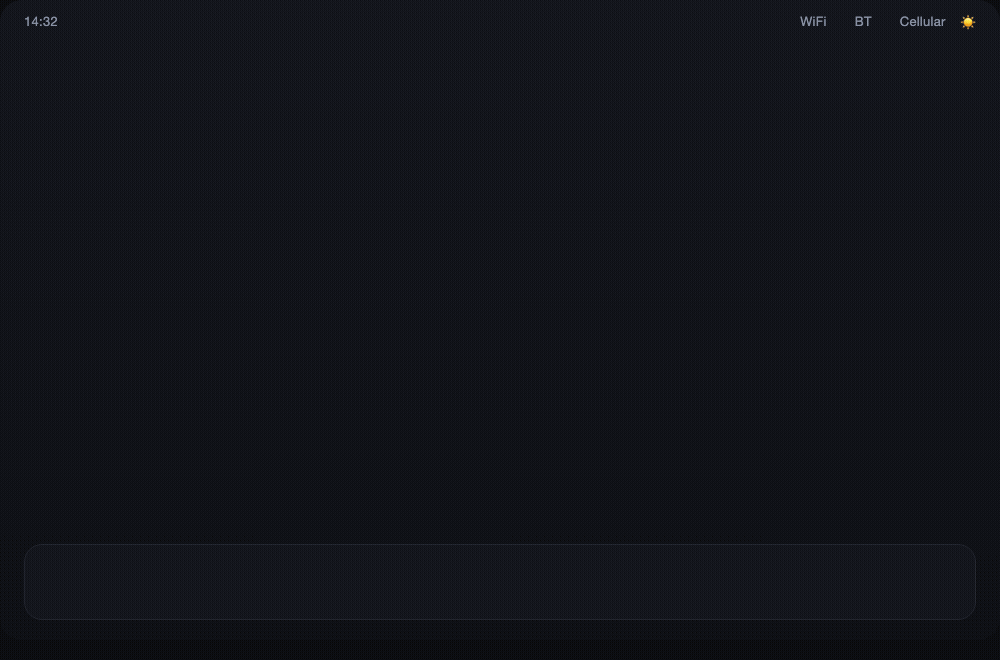
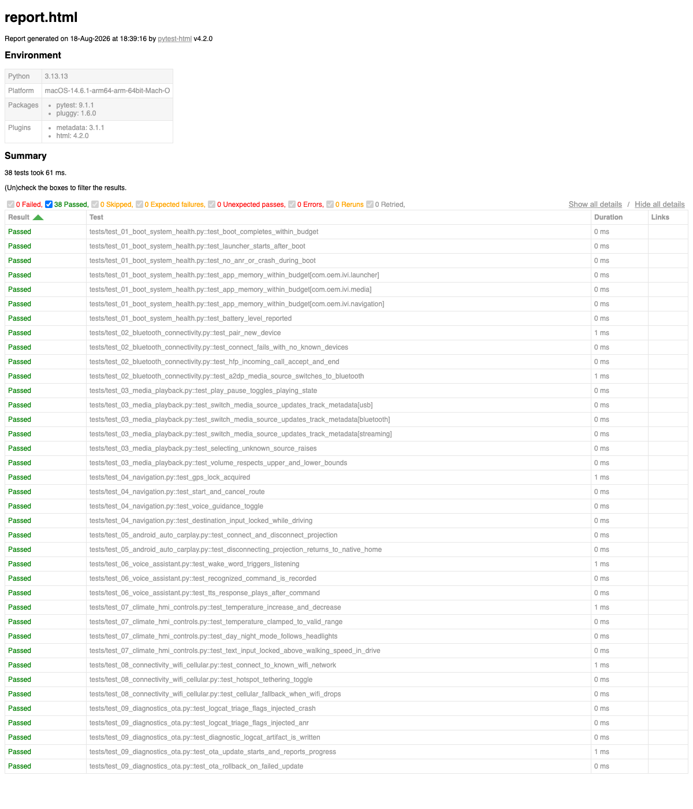

# ivi-test-agent

[](https://github.com/Madina1117/ivi-test-agent/actions/workflows/test.yml)
[](LICENSE)

🚘 **Android Automotive / In-Vehicle Infotainment (IVI) test automation suite**

pytest + Appium test automation for the head unit software in a connected vehicle — Bluetooth, media, navigation, phone projection, voice assistant, climate/HMI, connectivity, and diagnostics/OTA.

The suite runs two ways against the exact same test code and page objects:

- **Mock mode (default)** — drives an in-memory *virtual head unit*, so `pytest` runs green with zero Android SDK, emulator, or Appium server. This is what CI runs on every push.
- **`--real-device` mode** — drives a real head unit or Android emulator over **Appium + UiAutomator2**, with `adb` used for boot timing, memory, and logcat.

## Demo

A visual mock of the head unit, driven end-to-end by the actual `MockUIDriver` / page-object stack (not hand-animated — every screen change below is a real framework state transition, screenshotted after the fact):



The same test code running from the terminal:


...and the HTML report it produces:



## What It Tests

| Suite | Features |
|---|---|
| Boot & System Health | Boot time budget, launcher readiness, ANR/crash triage, per-app memory budget |
| Bluetooth Connectivity | Pairing, known-device reconnect, HFP call accept/end, A2DP source switch |
| Media Playback | Play/pause, USB/Bluetooth/streaming source switch, volume bounds, track metadata |
| Navigation | GPS lock, route start/cancel, voice guidance toggle, drive-mode input lockout |
| Android Auto / CarPlay Projection | Connect/disconnect phone projection, return-to-native-home on disconnect |
| Voice Assistant | Wake-word listening state, command recognition, TTS response |
| Climate & Vehicle HMI | Temperature control + clamping, day/night mode tied to headlight signal, speed-based UI lockout |
| Connectivity | WiFi connect, hotspot tethering toggle, automatic cellular fallback on WiFi loss |
| Diagnostics & OTA | Rule-based logcat triage (ANR/crash detection), OTA update start/rollback flow |

**9 suites · 38 test cases · rule-based failure triage · full CI pipeline**

## Quick Start

```bash
git clone https://github.com/Madina1117/ivi-test-agent.git
cd ivi-test-agent
python3 -m venv .venv && source .venv/bin/activate
pip install -r requirements.txt
pytest
```

That's it — no emulator, no Appium server, no vehicle hardware. Everything above runs against the built-in virtual head unit.

### Running against a real device

```bash
# Appium server + a connected head unit / Android Automotive emulator required
appium &
pytest --real-device --udid <device-udid>
```

Tests tagged `@pytest.mark.mock_only` (fault-injection scenarios) are skipped automatically in this mode; tests tagged `@pytest.mark.real_device` only run in this mode.

### Useful flags

```bash
pytest -m smoke                 # fast, high-value subset
pytest -m regression            # full-depth coverage
pytest -n auto                  # parallel run (pytest-xdist)
pytest --reruns 2               # retry flaky real-device runs
pytest --html=results/report.html --self-contained-html
```

## Architecture

```
┌───────────────────────────────────────────────────┐
│         pytest Test Suites (tests/test_*.py)       │
│   marker-tagged: smoke | regression | real_device   │
└───────────────────────┬─────────────────────────────┘
                        │ drives
                        ▼
┌───────────────────────────────────────────────────┐
│      Page Objects (src/pages/*.py)                  │
│  HomeScreen | BluetoothSettingsPage | MediaPlayerPage│
│  NavigationPage | AndroidAutoPage | VoiceAssistantPage│
│  ClimateHmiPage | ConnectivitySettingsPage | ...     │
└───────────────────────┬─────────────────────────────┘
                        │ calls
                        ▼
┌───────────────────────────────────────────────────┐
│    UIDriverBase (src/device/ui_driver.py)            │
│    AppiumUIDriver (real)   |   MockUIDriver (CI)      │
└───────────────────────┬─────────────────────────────┘
                        │ drives
                        ▼
┌───────────────────────────────────────────────────┐
│  Real Android Automotive head unit / emulator        │
│  — or — in-memory Virtual Head Unit (mock mode)       │
│  + VehicleBusSimulator (speed / gear / ignition /     │
│    headlights) for drive-state HMI lockout tests      │
└───────────────────────────────────────────────────┘
```

## Project Structure

```
ivi-test-agent/
├── tests/
│   ├── conftest.py                    # fixtures, CLI options, markers, failure hooks
│   ├── test_01_boot_system_health.py
│   ├── test_02_bluetooth_connectivity.py
│   ├── test_03_media_playback.py
│   ├── test_04_navigation.py
│   ├── test_05_android_auto_carplay.py
│   ├── test_06_voice_assistant.py
│   ├── test_07_climate_hmi_controls.py
│   ├── test_08_connectivity_wifi_cellular.py
│   └── test_09_diagnostics_ota.py
├── src/
│   ├── device/
│   │   ├── ui_driver.py               # UIDriverBase + AppiumUIDriver
│   │   ├── mock_driver.py             # MockUIDriver + virtual head unit state machine
│   │   └── android_device.py          # adb wrapper (boot/battery/memory/logcat)
│   ├── vehicle/
│   │   └── vehicle_bus_simulator.py   # CAN-like speed/gear/ignition signal injector
│   ├── pages/                         # Page Object Model, one file per screen
│   ├── analysis/
│   │   └── failure_analyzer.py        # rule-based logcat triage (ANR/crash/watchdog)
│   └── utils/
│       └── logcat.py
├── .github/workflows/test.yml
├── Jenkinsfile
├── pyproject.toml                     # pytest + ruff config
├── requirements.txt
├── requirements-dev.txt
└── results/                           # HTML reports, junit.xml, failure screenshots
```

## Tech Stack

- **pytest 8.x** — fixtures, markers, parametrization, custom CLI options, `hookwrapper` reporting hooks
- **Appium + UiAutomator2** — real Android head unit / emulator UI automation
- **adb** — boot timing, memory, battery, logcat
- **Page Object Model** — one page class per HMI screen, shared `BasePage`
- **pytest-html / pytest-xdist / pytest-rerunfailures** — reporting, parallelism, real-device flake retries
- **GitHub Actions + Jenkins** — CI on every push, plus a parameterized real-device pipeline

## Design Notes

- **Runs without hardware.** The mock/real split lives entirely behind `UIDriverBase`; page objects and tests are written once and never know which implementation they're talking to. This is what makes `pytest` green in CI with no Android SDK installed, while the same code drives real hardware locally.
- **`VehicleBusSimulator`** reproduces the handful of CAN signals (speed, gear, ignition, headlights) that actually change HMI behavior — e.g. destination/PIN/password text entry is locked above 5 km/h in Drive, and day/night mode follows the headlight signal. These are the same lockout rules a real head unit enforces off the real vehicle bus.
- **Failure triage is rule-based, not ML.** `FailureAnalyzer` matches logcat lines against known-bad regex signatures (ANR, fatal exception, watchdog reset, service timeout) and rolls them into a one-line summary attached to each failing test — deliberately simple and auditable rather than a black-box classifier.
